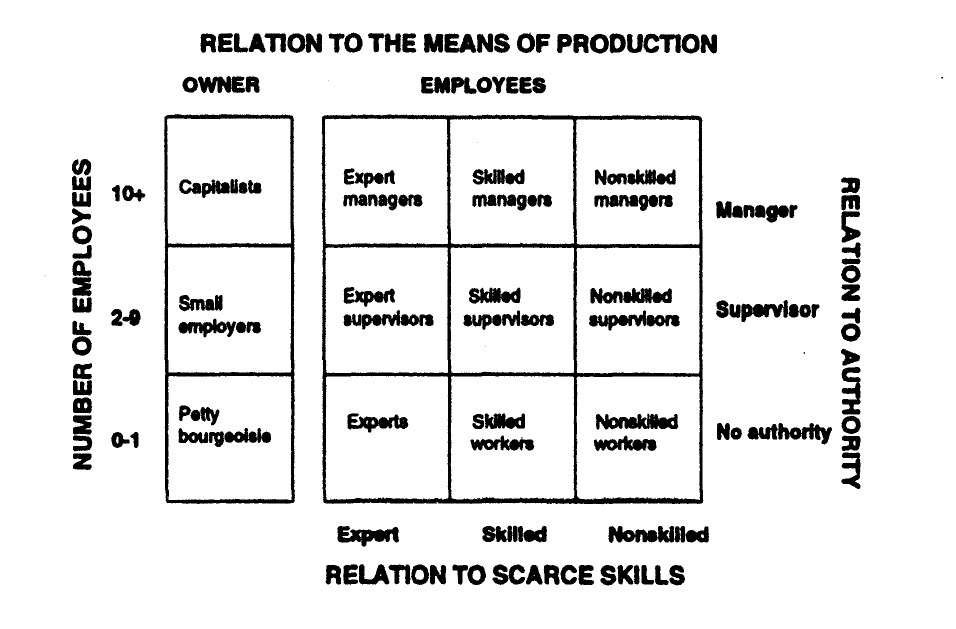

# Procesamiento Data Conclat Chile

Procesamiento de Data Conclat Chile actualizada para el 08/10/2025.

## Preparación

```{r librerias, echo=FALSE, warning=FALSE, message=FALSE}
rm(list=ls())
options(scipen = 999)

# install.packages("pacman")
library(pacman)
p_load(
  # generacion docs 
  flextable,         # tablas personalizadas para word
  kableExtra,        # mejorar tablas
  knitr,             # generar reportes reproducibles
  officer,           # crear/modifcar documentos word o ppt
  tinytex,           # instalación mínima de LaTeX para generar PDF
  
  # importacion datos 
  haven,             # impotar/exportar datos spss, stata, sas con etiquetas
  readr,             # lectura rápida de csv
  readxl,            # leer excel 
  
  # manipulacion 
  forcats,           # manipulación de factores
  janitor,           # limpia etiquetas
  labelled,          # trabajar con variables etiquetadas
  purrr,             # programación funcional para listas y data frames
  sjlabelled,        # manejar etiquetas 
  stringr,           # manipular texto
  sjmisc,            # limpieza y descripción de datos
  
  # visualizacion
  ggplot2,           # visualización basado en gramática de gráficos
  ggrepel,           # etiquetas en gráficos sin superposición
  gridExtra,         # combinar gráficos en uno solo
  scales,            # controla cómo se ven los ejes en gráficos
  sjPlot,            # visualizar resultados estadísticos
  
  # analisis
  psych,             # análisis general, psicométrico
  survey,            # diseño survey encuestas complejas
  srvyr,             # diseño survey con tidy
  rlang,             # motor interno de tidyverse, para usar expresiones 
  tidyverse,
  statar             # conectar con el lenguaje stata

  # # conexion web
  # curl,              # conexiones http de bajo nivel: para solucionar el problema de la api del ine
  # httr               # cliente http para API
  )
```

### Cargar datos

```{r datos, message=FALSE, warning=FALSE}
data <- readRDS("input/data/data-conclat.rds")

# sjlabelled::get_label(data)
```

## Procesamiento

### relation_mop

```{r}
# Situación empleo
data <- data %>%
  mutate(
    a07 = factor(
      as.numeric(a07),
      levels = 1:9,
      labels = c(
        "1. Patrón(a) o empleador(a)",
        "2. Trabajador(a) por cuenta propia",
        "3. Empleado(a) u obrero(a) del sector público (Gobierno Central o Municipal)",
        "4. Empleado(a) u obrero(a) de empresas públicas",
        "5. Empleado(a) u obrero(a) del sector privado",
        "6. Servicio doméstico puertas adentro",
        "7. Servicio doméstico puertas afuera",
        "8. FF.AA. y del Orden",
        "9. Familiar no remunerado"
      )
    )
  ) %>%
  set_variable_labels(a07 = "Employment situation")

frq(data$a07)

data <- data %>%
  mutate(
    relation_mop = case_when(
      as_numeric(a07) == 1 ~ 1,
      as_numeric(a07) == 2 ~ 2,
      as_numeric(a07) >= 3 ~ 3,
      TRUE ~ NA_real_
      ),
    relation_mop = factor(
      relation_mop,
      levels = 1:3,
      labels = c(
        "1. Employers",
        "2. Self-Employed",
        "3. Salaried"
      )
    )
  ) %>%
  set_variable_labels(relation_mop = "Relation with Means of Production")

frq(data$relation_mop)
```

### company_size

```{r}
frq(data$a26)

data <- data %>%
  mutate(
    company_size = case_when(
      a26 %in% c(1) ~ 1,
      a26 %in% c(2, 3) ~ 2,
      a26 %in% c(4, 5) ~ 3,
      a26 %in% c(6, 7) ~ 4,
      a26 %in% c(8, 9) ~ 5,
      TRUE ~ NA_real_
    ),
    company_size = factor(
      company_size, 
      levels = 1:5, 
      labels = c(
        "Solo",
        "2-9",
        "10-49",
        "50-199",
        "200 or more"),
      ordered = TRUE
    )
  ) %>%
  set_variable_labels(company_size = "Company Size")

frq(data$company_size)
```

### workplace_size

```{r}
frq(data$a27)

data <- data %>%
  mutate(
    workplace_size = case_when(
      a27 %in% c(1) ~ 1,
      a27 %in% c(2, 3) ~ 2,
      a27 %in% c(4, 5) ~ 3,
      a27 %in% c(6, 7) ~ 4,
      a27 %in% c(8, 9) ~ 5,
      TRUE ~ NA_real_
    ),
    workplace_size = factor(
      workplace_size, 
      levels = 1:5, 
      labels = c(
        "Solo",
        "2-9",
        "10-49",
        "50-199",
        "200 or more"),
      ordered = TRUE
    )
  ) %>%
  set_variable_labels(workplace_size = "Workplace Size")

frq(data$workplace_size)
```

### owners

-   1 == employers o self employed sin empleados
-   2 == employers o self employed con 2-9 empleados
-   3 == employers o self employed com \>= 10 empleados

```{r}
data <- data %>%
  mutate(
    owners = case_when(
      as.numeric(relation_mop) %in% c(1:2) & (as.numeric(company_size) == 1 | (is.na(company_size) & as.numeric(workplace_size) == 1)) ~ 1,
      as.numeric(relation_mop) %in% c(1:2) & (as.numeric(company_size) == 2 | (is.na(company_size) & as.numeric(workplace_size) == 2)) ~ 2,
      as.numeric(relation_mop) %in% c(1:2) & (as.numeric(company_size) >= 3 | (is.na(company_size) & as.numeric(workplace_size) >= 3)) ~ 3,
      TRUE ~ NA_real_
    ),
    owners = factor(
      owners,
      levels = 1:3,
      labels = c(
        "1. Solo Self-Employed",
        "2. Small employers",
        "3. Employers"
      )
    )
  ) %>%
  set_variable_labels(owners = "Owners")

frq(data$owners)
```

### owners2

-   1 == employers o self employed sin empleados
-   2 == employers o self employed con 2-49 empleados
-   3 == employers o self employed com \>= 50 empleados

```{r}
data <- data %>%
  mutate(
    owners2 = case_when(
      as.numeric(relation_mop) %in% c(1:2) & (as.numeric(company_size) == 1 | (is.na(company_size) & as.numeric(workplace_size) == 1)) ~ 1,
      as.numeric(relation_mop) %in% c(1:2) & (as.numeric(company_size) %in% c(2:3) | (is.na(company_size) & as.numeric(workplace_size) %in% c(2:3))) ~ 2,
      as.numeric(relation_mop) %in% c(1:2) & (as.numeric(company_size) >= 4 | (is.na(company_size) & as.numeric(workplace_size) >= 4)) ~ 3,
      TRUE ~ NA_real_
    ),
    owners2 = factor(
      owners2,
      levels = 1:3,
      labels = c(
        "1. Solo Self-Employed",
        "2. Small employers",
        "3. Capitalists"
      )
    )
  ) %>%
  set_variable_labels(owners2 = "Owners 2")

frq(data$owners2)
```

### educ

```{r}
frq(data$e05)

data <- data %>%
  mutate(
    educ = ifelse(e05 %in% c(-999, -888), NA, e05)
  ) %>%
  set_variable_labels(educ = "Educational level")

frq(data$educ)
```

### ciuo08

```{r}
frq(data$ciuo08_ine)
```


### skills

-   Experts -\> ciuo08_2d == 11 a 34 con universitaria completa o más (educ \>= 9) ---\> experts

-   Skilled -\> ciuo08_2d == 11 a 34 con universitaria incompleta o menos (educ \< 9), y

-   Skilled -\> ciuo08_2d == 35,36,41:44,53, y

-   Skilled -\> ciuo08_2d == 51,54,61,62,71:75,81 con media completa o más (educ \>= 5).

-   Unskilled -\> ciuo08_2d == 51,54,61,62,71:75,81 con media incompleta o menos, y

-   Unskilled -\> ciuo08_2d == 52,63,82,83,90+

-   61 62 71:75 --\> skilled

-   51,54,81 --\> unskilled

```{r}
data <- data %>% 
  mutate(
    skills = case_when(
      ciuo08_ine <= 34 & educ >= 9 ~ 1,
      ciuo08_ine <= 34 & is.na(educ)~ 1,  
      
      ciuo08_ine <= 34 & educ < 9 ~ 2,
      ciuo08_ine %in% c(35, 36, 41:44, 53) ~ 2,
      ciuo08_ine %in% c(51, 54, 61, 62, 71:75, 81) & educ >= 5 ~ 2,
      ciuo08_ine %in% c(61, 62, 71:75) & is.na(educ) ~ 2,
      
      ciuo08_ine %in% c(51, 54, 61, 62, 71:75, 81) & educ <= 4 ~ 3,
      ciuo08_ine %in% c(52, 63, 82, 83, 91:99) ~ 3,
      ciuo08_ine %in% c(51, 54, 81) & is.na(educ) ~ 3     
    ),
    skills = factor(
      skills, 
      levels = 1:3,
      labels = c(
        "1. Experts",
        "2. Skilled",
        "3. Unskilled"
      )
    )
  ) %>%
  set_variable_labels(skills = "Skills")


frq(data$skills)
```

### formal_position_auth

```{r}
frq(data$a15)

data <- data %>%
  mutate(
    formal_position_auth = case_when(
      as.numeric(relation_mop) %in% c(1, 2) ~ NA_real_,
      TRUE ~ as.numeric(a15)
    ),
    formal_position_auth = factor(
      formal_position_auth,
      levels = 1:4,
      labels = c(
        "1. Senior manager or executive",
        "2. Middle manager (e.g., sector, office or branch head)",
        "3. Supervisor or foreperson",
        "4. Regular employee or worker (no supervisory role)"
      )
    )
  ) %>%
  set_variable_labels(formal_position_auth = "Formal position of authority (a15)")

frq(data$formal_position_auth)
```

### supervision

```{r}
frq(data$a16)

data <- data %>%
  mutate(
    supervision = case_when(
      a16 == 1 ~ 1,
      a16 %in% c(2, -888, -999) ~ 0,
      TRUE ~ NA_real_
    )
  ) %>%
  set_variable_labels(supervision = "Supervises other workers (a16)") %>% 
  set_value_labels(supervision = c(
    "Yes" = 1,
    "No" = 0
  ))

frq(data$supervision)
```

### decisionmaking_typology

```{r}
frq(data$a17_01)
frq(data$a17_02)
frq(data$a17_03)
frq(data$a17_04)
frq(data$a17_05)
frq(data$a17_06)

data <- data %>%
  mutate(
    decisionmaking_typology = if_else(
      is.na(a17_01),
      NA_real_,
      rowSums(across(a17_01:a17_06, ~ case_when(
        .x == 1 ~ 3,
        .x == 2 ~ 2,
        .x == 3 ~ 1,
        .x %in% c(-888, -999) ~ 1,  
        TRUE ~ NA_real_
      )), na.rm = TRUE)
    ),
    decisionmaking_typology_mean = if_else(
      is.na(a17_01),
      NA_real_,
      rowMeans(across(a17_01:a17_06, ~ case_when(
        .x == 1 ~ 3,
        .x == 2 ~ 2,
        .x == 3 ~ 1,
        .x %in% c(-888, -999) ~ 1,
        TRUE ~ NA_real_
      )), na.rm = TRUE)
    )
  ) %>%
  set_variable_labels(
    decisionmaking_typology = "Decision-making typology (sum, inverted)",
    decisionmaking_typology_mean = "Decision-making typology (mean, inverted)"
  )

frq(data$decisionmaking_typology)
frq(data$decisionmaking_typology_mean)

# Crear variable con 3 categorías
data <- data %>%
  mutate(
    decisionmaking_typology_cat = case_when(
      decisionmaking_typology_mean == 1 ~ 1,
      decisionmaking_typology_mean > 1 & decisionmaking_typology_mean < 3 ~ 2,
      decisionmaking_typology_mean == 3 ~ 3
    ),
    decisionmaking_typology_cat = factor(
      decisionmaking_typology_cat,
      levels = 1:3
    )
  ) %>%
  set_variable_labels(
    decisionmaking_typology_cat = "Decision-making typology (recoded 3 categories)"
  )

frq(data$decisionmaking_typology_cat)
```

### managerial_location_typology

```{r}
data <- data %>%
  mutate(
    managerial_location_typology = case_when(
      as.integer(decisionmaking_typology_cat) == 3 & supervision == 1 & as.integer(formal_position_auth) %in% 1:3 ~ 1,
      as.integer(decisionmaking_typology_cat) == 3 & supervision == 1 & as.integer(formal_position_auth) == 4 ~ 2,
      as.integer(decisionmaking_typology_cat) == 3 & supervision == 0 & as.integer(formal_position_auth) %in% 1:3 ~ 3,
      as.integer(decisionmaking_typology_cat) == 3 & supervision == 0 & as.integer(formal_position_auth) == 4 ~ 4,
      as.integer(decisionmaking_typology_cat) == 2 & supervision == 1 & as.integer(formal_position_auth) %in% 1:3 ~ 5,
      as.integer(decisionmaking_typology_cat) == 2 & supervision == 1 & as.integer(formal_position_auth) == 4 ~ 6,
      as.integer(decisionmaking_typology_cat) == 2 & supervision == 0 & as.integer(formal_position_auth) %in% 1:3 ~ 7,
      as.integer(decisionmaking_typology_cat) == 2 & supervision == 0 & as.integer(formal_position_auth) == 4 ~ 8,
      as.integer(decisionmaking_typology_cat) == 1 & supervision == 1 & as.integer(formal_position_auth) %in% 1:3 ~ 9,
      as.integer(decisionmaking_typology_cat) == 1 & supervision == 1 & as.integer(formal_position_auth) == 4 ~ 10,
      as.integer(decisionmaking_typology_cat) == 1 & supervision == 0 & as.integer(formal_position_auth) %in% 1:3 ~ 11,
      as.integer(decisionmaking_typology_cat) == 1 & supervision == 0 & as.integer(formal_position_auth) == 4 ~ 12
    ),
    managerial_location_typology = factor(
      managerial_location_typology,
      levels = 1:12,
      labels = c(
        "1. Manager on all criteria",
        "2. Manager not in formal hierarchy",
        "3. Non-supervisory manager",
        "4. Non-supervisory decision-maker not in formal hierarchy",
        "5. Advisor-manager on all criteria",
        "6. Advisor not in hierarchy",
        "7. Non-supervisory advisor",
        "8. Non-supervisory advisor not in formal hierarchy",
        "9. Sanctioning / task supervisor in hierarchy",
        "10. Sanctioning / task supervisor not in hierarchy",
        "11. Not subordinates but in hierarchy",
        "12. Non-supervisor / non manager on all criteria"
      )
    )
  ) %>%
  set_variable_labels(managerial_location_typology = "Managerial Location Typology")

frq(data$managerial_location_typology)
```
### organization_assets

```{r}
data <- data %>%
  mutate(
    organization_assets = case_when(
      as.integer(managerial_location_typology) %in% c(1, 2, 3, 5) ~ 1,
      as.integer(managerial_location_typology) %in% c(6, 7, 9, 10) ~ 2,
      as.integer(managerial_location_typology) %in% c(4, 8, 11, 12) ~ 3
    ),
    organization_assets = factor(
      organization_assets,
      levels = 1:3,
      labels = c(
        "1. Manager",
        "2. Supervisor",
        "3. Non-managerial worker"
      )
    )
  ) %>%
  set_variable_labels(organization_assets = "Organizational Assets")

frq(data$organization_assets)
```

### a06_boleta

```{r}
frq(data$a06)

data <- data %>% 
  mutate(
    a06_boleta = case_when(
      a06 %in% c(1, 2) ~ 1,
      a06 %in% c(3, -888, -999) ~ 0
    )) %>% 
  set_variable_labels(a06_boleta = "Entrega boleta (1 = yes)") %>% 
  set_value_labels(a06_boleta = c(
    "Yes" = 1,
    "No" = 0
  ))

frq(data$a06_boleta)
```

### inicio_activ

```{r}
frq(data$a10)

data <- data %>% 
  mutate(
    inicio_activ = case_when(
      a10 %in% c(1:4) ~ 1,
      a10 %in% c(5, -888, -999) ~ 0
    )
  )%>% 
  set_variable_labels(inicio_activ = "Incio de actividades (1 = yes)") %>% 
  set_value_labels(inicio_activ = c(
    "Yes" = 1,
    "No" = 0
  ))

frq(data$inicio_activ)
```

### inicio_activ2

```{r}
frq(data$a10)

data <- data %>% 
  mutate(
    inicio_activ2 = case_when(
      a10 %in% c(2:4) ~ 1,
      a10 %in% c(1, 5, -888, -999) ~ 0
    )
  )%>% 
  set_variable_labels(inicio_activ2 = "Incio de actividades 2 (1 = yes)") %>% 
  set_value_labels(inicio_activ2 = c(
    "Yes" = 1,
    "No" = 0
  ))

frq(data$inicio_activ2)
```

### a18_contrato

```{r}
frq(data$a18)

data <- data %>% 
  mutate(
    a18_contrato = case_when(
      a18 == 1 ~ 1, 
      a18 %in% c(2, 3, 4, -999) ~ 0
    )
  ) %>% 
  set_variable_labels(a18_contrato = "Has a signed written employment contract (1 = yes)") %>% 
  set_value_labels(a18_contrato = c(
    "Yes" = 1,
    "No" = 0
  ))

frq(data$a18_contrato)
```

## Classes



### Esquema de clases de Erik Olin Wright

<style>
/* ===== Wright class scheme — fluid, centered, TOC-safe ===== */
.wright-box{
  /* el ancho total del esquema se adapta al contenedor */
  --maxw: clamp(520px, 92vw, 860px);
  width: min(100%, var(--maxw));
  margin: 8px auto 18px auto;  /* centrado */
}

.wright-grid{
  display: grid;
  /* 5 columnas: izquierda, OWNER, 3 centrales, derecha
     porcentajes + minmax para que quepa siempre */
  grid-template-columns:
    minmax(60px, 8%)         /* Nº empleados */
    minmax(140px, 22%)       /* OWNER */
    repeat(3, minmax(120px, 1fr)) /* Expert/Skilled/Nonskilled */
    minmax(90px, 12%);       /* Autoridad */
  /* filas: top, headers, 3 datos, bottom */
  grid-template-rows:
    56px 86px repeat(3, 90px) 56px;

  border: 2px solid #000;
  background: #fff;
  font-family: "Noto Serif", serif;
  font-size: .95rem;
}
.wcell{
  border: 1px solid #000;
  display:flex; align-items:center; justify-content:center;
  text-align:center; padding:6px;
}

/* cabeceras */
.w-top    { grid-column: 3 / span 3; font-weight:800; background:#f3f3f3; }
.w-bot    { grid-column: 3 / span 3; font-weight:800; background:#f3f3f3; }
.w-head   { font-weight:800; background:#fbfbfb; }
.w-ownerH { font-weight:800; background:#fbfbfb; }

/* etiquetas verticales dentro del marco */
.w-leftH, .w-rightH{
  font-weight:800; background:#fbfbfb;
  writing-mode: vertical-rl; transform: rotate(180deg);
  letter-spacing:.4px;
}

/* columnas de datos */
.w-left   { }
.w-right  { font-weight:700; }
.w-owner  { font-weight:700; }

/* Ajustes responsivos extra chicos */
@media (max-width: 640px){
  .wright-grid{ font-size: .9rem; }
  .w-leftH, .w-rightH{ letter-spacing: 0; }
}
</style>

<div class="wright-box">
<div class="wright-grid">
<!-- fila 1: cabecera superior -->
<div class="wcell w-leftH"></div>
<div class="wcell"></div>
<div class="wcell w-top">RELATION TO THE MEANS OF PRODUCTION</div>
<div class="wcell"></div>

<!-- fila 2: encabezados -->
<div class="wcell w-leftH">NUMBER OF EMPLOYEES</div>
<div class="wcell w-ownerH">OWNER</div>
<div class="wcell w-head">Expert</div>
<div class="wcell w-head">Skilled</div>
<div class="wcell w-head">Nonskilled</div>
<div class="wcell w-rightH">RELATION TO AUTHORITY</div>

<!-- fila 3 -->
<div class="wcell w-left">10+</div>
<div class="wcell w-owner">Capitalists</div>
<div class="wcell">Expert managers</div>
<div class="wcell">Skilled managers</div>
<div class="wcell">Non-skilled managers</div>
<div class="wcell w-right">Manager</div>

<!-- fila 4 -->
<div class="wcell w-left">2–9</div>
<div class="wcell w-owner">Small employers</div>
<div class="wcell">Expert supervisors</div>
<div class="wcell">Skilled supervisors</div>
<div class="wcell">Non-skilled supervisors</div>
<div class="wcell w-right">Supervisor</div>

<!-- fila 5 -->
<div class="wcell w-left">0–1</div>
<div class="wcell w-owner">Petty bourgeoisie</div>
<div class="wcell">Experts</div>
<div class="wcell">Skilled workers</div>
<div class="wcell">Non-skilled workers</div>
<div class="wcell w-right">No authority</div>

<!-- fila 6: pie -->
<div class="wcell"></div>
<div class="wcell"></div>
<div class="wcell w-bot">RELATION TO SCARCE SKILLS</div>
<div class="wcell"></div>
<div class="wcell"></div>
</div>
</div>

### wrightclass1_original

**employers: employers con 10 o más trabajadores**

```{r}
data <- data %>%
  mutate(
    wrightclass1_original = case_when(
      as.integer(owners) == 3 ~ 1,  # 1. Employers
      as.integer(owners) == 2 ~ 2,  # 2. Small employers
      as.integer(owners) == 1 ~ 3,  # 3. Petty bourgeoisie
      
      as.integer(organization_assets) == 1 & as.integer(skills) == 1 ~ 4,  # 4. Expert managers
      as.integer(organization_assets) == 2 & as.integer(skills) == 1 ~ 5,  # 5. Expert supervisors
      as.integer(organization_assets) == 3 & as.integer(skills) == 1 ~ 6,  # 6. Experts
      
      as.integer(organization_assets) == 1 & as.integer(skills) == 2 ~ 7,  # 7. Skilled managers
      as.integer(organization_assets) == 2 & as.integer(skills) == 2 ~ 8,  # 8. Skilled supervisors
      as.integer(organization_assets) == 3 & as.integer(skills) == 2 ~ 9,  # 9. Skilled workers
      
      as.integer(organization_assets) == 1 & as.integer(skills) == 3 ~ 10, # 10. Nonskilled managers
      as.integer(organization_assets) == 2 & as.integer(skills) == 3 ~ 11, # 11. Nonskilled supervisors
      as.integer(organization_assets) == 3 & as.integer(skills) == 3 ~ 12  # 12. Nonskilled workers
    ),
    wrightclass1_original = factor(
      wrightclass1_original,
      levels = 1:12,
      labels = c(
        "1. Employers",
        "2. Small employers",
        "3. Petty bourgeoisie",
        "4. Expert managers",
        "5. Expert supervisors",
        "6. Experts",
        "7. Skilled managers",
        "8. Skilled supervisors",
        "9. Skilled workers",
        "10. Nonskilled managers",
        "11. Nonskilled supervisors",
        "12. Nonskilled workers"
      )
    )
  ) %>%
  set_variable_labels(wrightclass1_original = "Wright Class Typology")

frq(data$wrightclass1_original)

# base survey
data_svy <- as_survey_design(data, weights = rake_wb2)

# Tabla de frecuencias ponderadas
wright_freq <- data_svy %>%
  group_by(wrightclass1_original) %>%
  summarise(
    freq = survey_mean(vartype = NULL, na.rm = TRUE),
    n_unweighted = unweighted(n())
  ) %>%
  mutate(
    freq_pct = freq * 100
  )

wright_freq %>%
  print(n = Inf)
```

### wrightclass2_capitalists

**capitalists: employers 50 o más trabajadores**

```{r}
data <- data %>%
  mutate(
    wrightclass2_capitalists = case_when(
      as.integer(owners2) == 3 ~ 1,  # 1. Capitalists
      as.integer(owners2) == 2 ~ 2,  # 2. Small employers
      as.integer(owners2) == 1 ~ 3,  # 3. Petty bourgeoisie
      
      as.integer(organization_assets) == 1 & as.integer(skills) == 1 ~ 4,  # 4. Expert managers
      as.integer(organization_assets) == 2 & as.integer(skills) == 1 ~ 5,  # 5. Expert supervisors
      as.integer(organization_assets) == 3 & as.integer(skills) == 1 ~ 6,  # 6. Experts
      
      as.integer(organization_assets) == 1 & as.integer(skills) == 2 ~ 7,  # 7. Skilled managers
      as.integer(organization_assets) == 2 & as.integer(skills) == 2 ~ 8,  # 8. Skilled supervisors
      as.integer(organization_assets) == 3 & as.integer(skills) == 2 ~ 9,  # 9. Skilled workers
      
      as.integer(organization_assets) == 1 & as.integer(skills) == 3 ~ 10, # 10. Nonskilled managers
      as.integer(organization_assets) == 2 & as.integer(skills) == 3 ~ 11, # 11. Nonskilled supervisors
      as.integer(organization_assets) == 3 & as.integer(skills) == 3 ~ 12  # 12. Nonskilled workers
    ),
    wrightclass2_capitalists = factor(
      wrightclass2_capitalists,
      levels = 1:12,
      labels = c(
        "1. Capitalists",
        "2. Small employers",
        "3. Petty bourgeoisie",
        "4. Expert managers",
        "5. Expert supervisors",
        "6. Experts",
        "7. Skilled managers",
        "8. Skilled supervisors",
        "9. Skilled workers",
        "10. Nonskilled managers",
        "11. Nonskilled supervisors",
        "12. Nonskilled workers"
      )
    )
  ) %>%
  set_variable_labels(wrightclass2_capitalists = "Wright Class Typology (2)")

frq(data$wrightclass2_capitalists)

# base survey
data_svy <- as_survey_design(data, weights = rake_wb2)

# Tabla de frecuencias ponderadas
wright_freq <- data_svy %>%
  group_by(wrightclass2_capitalists) %>%
  summarise(
    freq = survey_mean(vartype = NULL, na.rm = TRUE),
    n_unweighted = unweighted(n())
  ) %>%
  mutate(
    freq_pct = freq * 100
  )

wright_freq %>%
  print(n = Inf)
```

### wrightclass1_informal

```{r}
data <- data %>%
  mutate(
    wrightclass1_informal = case_when(
      as.integer(owners) == 3 ~ 1,  # 1. Employers
      as.integer(owners) == 2 ~ 2,  # 2. Small employers
      
      as.integer(owners) == 1 & a06_boleta == 1 ~ 3,   # 3. Petty bourgeoisie
      as.integer(owners) == 1 & a06_boleta == 0 ~ 4,   # 4. Informal self-employed
      
      as.integer(organization_assets) == 1 & as.integer(skills) == 1 ~ 5,  # 5. Expert managers
      as.integer(organization_assets) == 2 & as.integer(skills) == 1 ~ 6,  # 6. Expert supervisors
      as.integer(organization_assets) == 3 & as.integer(skills) == 1 ~ 7,  # 7. Experts
      
      as.integer(organization_assets) == 1 & as.integer(skills) == 2 ~ 8,  # 8. Skilled managers
      as.integer(organization_assets) == 2 & as.integer(skills) == 2 ~ 9,  # 9. skilled supervisors
      as.integer(organization_assets) == 1 & as.integer(skills) == 3 ~ 10, # 10. Nonskilled managers
      as.integer(organization_assets) == 2 & as.integer(skills) == 3 ~ 11, # 11. Nonskilled supervisors
      
      as.integer(organization_assets) == 3 & as.integer(skills) %in% c(2, 3) & a18_contrato == 1 ~ 12, # 12. Formal workers
      as.integer(organization_assets) == 3 & as.integer(skills) %in% c(2, 3) & a18_contrato == 0 ~ 13  # 13. Informal workers
    ),
    wrightclass1_informal = factor(
      wrightclass1_informal,
      levels = 1:13,
      labels = c(
        "1. Employers",
        "2. Small employers",
        "3. Petty bourgeoisie",
        "4. Informal self-employed",
        "5. Expert managers",
        "6. Expert supervisors",
        "7. Experts",
        "8. Skilled managers",
        "9. Skilled supervisors",
        "10. Nonskilled managers",
        "11. Nonskilled supervisors",
        "12. Formal workers",
        "13. Informal workers"
      )
    )
  ) %>%
  set_variable_labels(wrightclass1_informal = "Wright Class Typology + Informal (3)")

frq(data$wrightclass1_informal)

# base survey
data_svy <- as_survey_design(data, weights = rake_wb2)

# Tabla de frecuencias ponderadas
wright_freq <- data_svy %>%
  group_by(wrightclass1_informal) %>%
  summarise(
    freq = survey_mean(vartype = NULL, na.rm = TRUE),
    n_unweighted = unweighted(n())
  ) %>%
  mutate(
    freq_pct = freq * 100
  )

wright_freq %>%
  print(n = Inf)
```

### wrightclass2_informal

```{r}
data <- data %>%
  mutate(
    wrightclass2_informal = case_when(
      as.integer(owners2) == 3 ~ 1,  # 1. Capitalists
      as.integer(owners2) == 2 ~ 2,  # 2. Small employers
      
      as.integer(owners2) == 1 & a06_boleta == 1 ~ 3,   # 3. Petty bourgeoisie
      as.integer(owners2) == 1 & a06_boleta == 0 ~ 4,   # 4. Informal self-employed
      
      as.integer(organization_assets) == 1 & as.integer(skills) == 1 ~ 5,  # 5. Expert managers
      as.integer(organization_assets) == 2 & as.integer(skills) == 1 ~ 6,  # 6. Expert supervisors
      as.integer(organization_assets) == 3 & as.integer(skills) == 1 ~ 7,  # 7. Experts
      
      as.integer(organization_assets) == 1 & as.integer(skills) == 2 ~ 8,  # 8. Skilled managers
      as.integer(organization_assets) == 2 & as.integer(skills) == 2 ~ 9,  # 9. skilled supervisors
      as.integer(organization_assets) == 1 & as.integer(skills) == 3 ~ 10, # 10. Nonskilled managers
      as.integer(organization_assets) == 2 & as.integer(skills) == 3 ~ 11, # 11. Nonskilled supervisors
      
      as.integer(organization_assets) == 3 & as.integer(skills) %in% c(2, 3) & a18_contrato == 1 ~ 12, # 12. Formal workers
      as.integer(organization_assets) == 3 & as.integer(skills) %in% c(2, 3) & a18_contrato == 0 ~ 13  # 13. Informal workers
    ),
    wrightclass2_informal = factor(
      wrightclass2_informal,
      levels = 1:13,
      labels = c(
        "1. Capitalists",
        "2. Small employers",
        "3. Petty bourgeoisie",
        "4. Informal self-employed",
        "5. Expert managers",
        "6. Expert supervisors",
        "7. Experts",
        "8. Skilled managers",
        "9. Skilled supervisors",
        "10. Nonskilled managers",
        "11. Nonskilled supervisors",
        "12. Formal workers",
        "13. Informal workers"
      )
    )
  ) %>%
  set_variable_labels(wrightclass2_informal = "Wright Class Typology + Informal (4)")

frq(data$wrightclass2_informal)

# base survey
data_svy <- as_survey_design(data, weights = rake_wb2)

# Tabla de frecuencias ponderadas
wright_freq <- data_svy %>%
  group_by(wrightclass2_informal) %>%
  summarise(
    freq = survey_mean(vartype = NULL, na.rm = TRUE),
    n_unweighted = unweighted(n())
  ) %>%
  mutate(
    freq_pct = freq * 100
  )

wright_freq %>%
  print(n = Inf)
```

### wrightclass1_reduced (comp. cl-ar)

```{r}
# Modelo para comprar con datos de Argentina 
data <- data %>%
  mutate(
    wrightclass1_reduced = case_when(
      as.integer(organization_assets) == 3 & as.integer(skills) %in% c(2, 3) & a18_contrato == 1 ~ 1,  # 1. Formal workers
      as.integer(organization_assets) == 3 & as.integer(skills) %in% c(2, 3) & a18_contrato == 0 ~ 2,  # 2. Informal workers
      as.integer(owners) == 1 & a06_boleta == 0 ~ 3,                                                   # 3. Informal self-employed
      as.integer(organization_assets) == 3 & as.integer(skills) == 1 ~ 4,                              # 4. Experts
      as.integer(organization_assets) == 2 & as.integer(skills) %in% c(1, 2, 3) ~ 5,                   # 5. Supervisors
      as.integer(organization_assets) == 1 & as.integer(skills) %in% c(1, 2, 3) ~ 6,                   # 6. Managers
      as.integer(owners) == 1 & a06_boleta == 1 ~ 7,                                                   # 7. Petty bourgeoisie
      as.integer(owners) == 2 ~ 8,                                                                     # 8. Small employers
      as.integer(owners) == 3 ~ 9                                                                      # 9. Employers
    ),
    wrightclass1_reduced = factor(
      wrightclass1_reduced,
      levels = 1:9,
      labels = c(
        "1. Formal workers",
        "2. Informal workers",
        "3. Informal self-employed",
        "4. Experts",       
        "5. Supervisors",
        "6. Managers",
        "7. Petty bourgeoisie",
        "8. Small employers",
        "9. Employers"
      )
    )
  ) %>%
  set_variable_labels(wrightclass1_reduced = "Wright Class Typology Reduced (5)")

frq(data$wrightclass1_reduced)

# base survey
data_svy <- as_survey_design(data, weights = rake_wb2)

# Tabla de frecuencias ponderadas
wright_freq <- data_svy %>%
  group_by(wrightclass1_reduced) %>%
  summarise(
    freq = survey_mean(vartype = NULL, na.rm = TRUE),
    n_unweighted = unweighted(n())
  ) %>%
  mutate(
    freq_pct = freq * 100
  )

wright_freq %>%
  print(n = Inf)
```

### wrightclass2_reduced (comp. cl-ar)

```{r}
data <- data %>%
  mutate(
    wrightclass2_reduced = case_when(
      as.integer(organization_assets) == 3 & as.integer(skills) %in% c(2, 3) & a18 == 1 ~ 1,                  # 1. Formal workers
      as.integer(organization_assets) == 3 & as.integer(skills) %in% c(2, 3) & a18 %in% c(2, 3, 4, -999) ~ 2, # 2. Informal workers
      as.integer(owners2) == 1 & a06_boleta == 0 ~ 3,                                                         # 3. Informal self-employed
      as.integer(organization_assets) == 3 & as.integer(skills) == 1 ~ 4,                                     # 4. Experts      
      as.integer(organization_assets) == 2 & as.integer(skills) %in% c(1, 2, 3) ~ 5,                          # 5. Supervisors
      as.integer(organization_assets) == 1 & as.integer(skills) %in% c(1, 2, 3) ~ 6,                          # 6. Managers
      as.integer(owners2) == 1 & a06_boleta == 1 ~ 7,                                                         # 7. Petty bourgeoisie
      as.integer(owners2) == 2 ~ 8,                                                                           # 8. Small employers
      as.integer(owners2) == 3 ~ 9                                                                            # 9. Capitalists
    ),
    wrightclass2_reduced = factor(
      wrightclass2_reduced,
      levels = 1:9,
      labels = c(
        "1. Formal workers",
        "2. Informal workers",
        "3. Informal self-employed",
        "4. Experts",
        "5. Supervisors",
        "6. Managers",
        "7. Petty bourgeoisie",
        "8. Small employers",
        "9. Capitalists"
      )
    )
  ) %>%
  set_variable_labels(wrightclass2_reduced = "Wright Class Typology Reduced (6)")

frq(data$wrightclass2_reduced)

# base survey
data_svy <- as_survey_design(data, weights = rake_wb2)

# Tabla de frecuencias ponderadas
wright_freq <- data_svy %>%
  group_by(wrightclass2_reduced) %>%
  summarise(
    freq = survey_mean(vartype = NULL, na.rm = TRUE),
    n_unweighted = unweighted(n())
  ) %>%
  mutate(
    freq_pct = freq * 100
  )

wright_freq %>%
  print(n = Inf)
```

### wrightclass1_reduced2

```{r}
data <- data %>%
  mutate(
    wrightclass1_reduced2 = case_when(
      as.integer(organization_assets) == 3 & as.integer(skills) %in% c(2, 3) & a18_contrato == 1 ~ 1,  # 1. Formal workers
      as.integer(organization_assets) == 3 & as.integer(skills) %in% c(2, 3) & a18_contrato == 0 ~ 2,  # 2. Informal workers
      as.integer(owners) == 1 & a06_boleta == 0 ~ 3,                                                   # 3. Informal self-employed
      as.integer(organization_assets) == 3 & as.integer(skills) == 1 ~ 4,                              # 4. Experts
      as.integer(organization_assets) == 2 & as.integer(skills) %in% c(1, 2, 3) ~ 5,                   # 5. Supervisors
      as.integer(organization_assets) == 1 & as.integer(skills) %in% c(1, 2, 3) ~ 6,                   # 6. Managers
      as.integer(owners) == 1 & a06_boleta == 1 ~ 7,                                                   # 7. Petty bourgeoisie
      as.integer(owners) %in% c(2, 3) ~ 8                                                              # 8. Employers
    ),
    wrightclass1_reduced2 = factor(
      wrightclass1_reduced2,
      levels = 1:8,
      labels = c(
        "1. Formal workers",
        "2. Informal workers",
        "3. Informal self-employed",
        "4. Experts",       
        "5. Supervisors",
        "6. Managers",
        "7. Petty bourgeoisie",
        "8. Employers"
      )
    )
  ) %>%
  set_variable_labels(wrightclass1_reduced2 = "Wright Class Typology Reduced (7)")

frq(data$wrightclass1_reduced2)

# base survey
data_svy <- as_survey_design(data, weights = rake_wb2)

# Tabla de frecuencias ponderadas
wright_freq <- data_svy %>%
  group_by(wrightclass1_reduced2) %>%
  summarise(
    freq = survey_mean(vartype = NULL, na.rm = TRUE),
    n_unweighted = unweighted(n())
  ) %>%
  mutate(
    freq_pct = freq * 100
  )

wright_freq %>%
  print(n = Inf)
```


### wrightclass2_reduced2

```{r}
data <- data %>%
  mutate(
    wrightclass2_reduced2 = case_when(
      as.integer(organization_assets) == 3 & as.integer(skills) %in% c(2, 3) & a18_contrato == 1 ~ 1,  # 1. Formal workers
      as.integer(organization_assets) == 3 & as.integer(skills) %in% c(2, 3) & a18_contrato == 0 ~ 2,  # 2. Informal workers
      as.integer(owners) == 1 & a06_boleta == 0 ~ 3,                                                   # 3. Informal self-employed
      as.integer(organization_assets) == 3 & as.integer(skills) == 1 ~ 4,                              # 4. Experts
      as.integer(organization_assets) == 2 & as.integer(skills) %in% c(1, 2, 3) ~ 5,                   # 5. Supervisors
      as.integer(organization_assets) == 1 & as.integer(skills) %in% c(1, 2, 3) ~ 6,                   # 6. Managers
      as.integer(owners2) == 1 & a06_boleta == 1 ~ 7,                                                  # 7. Petty bourgeoisie
      as.integer(owners2) %in% c(2, 3) ~ 8                                                             # 8. Employers
    ),
    wrightclass2_reduced2 = factor(
      wrightclass2_reduced2,
      levels = 1:8,
      labels = c(
        "1. Formal workers",
        "2. Informal workers",
        "3. Informal self-employed",
        "4. Experts",       
        "5. Supervisors",
        "6. Managers",
        "7. Petty bourgeoisie",
        "8. Capitalists"
      )
    )
  ) %>%
  set_variable_labels(wrightclass2_reduced2 = "Wright Class Typology Reduced (8)")

frq(data$wrightclass2_reduced2)

# base survey
data_svy <- as_survey_design(data, weights = rake_wb2)

# Tabla de frecuencias ponderadas
wright_freq <- data_svy %>%
  group_by(wrightclass2_reduced2) %>%
  summarise(
    freq = survey_mean(vartype = NULL, na.rm = TRUE),
    n_unweighted = unweighted(n())
  ) %>%
  mutate(
    freq_pct = freq * 100
  )

wright_freq %>%
  print(n = Inf)
```

### wrightclass1_reduced3

```{r}
data <- data %>%
  mutate(
    wrightclass1_reduced3 = case_when(
      as.integer(owners) == 3 ~ 1,                                                                           # 1. Capitalists
      as.integer(owners) == 2 ~ 2,                                                                           # 2. Small employers   
      as.integer(owners) == 1 & a06_boleta == 1 ~ 3,                                                         # 3. Petty bourgeoisie  
      
      as.integer(organization_assets) == 1 & as.integer(skills) == 1 ~ 4,                                     # 4. Expert managers   
      as.integer(organization_assets) == 3 & as.integer(skills) == 1 ~ 5,                                     # 5. Experts  
      
      as.integer(organization_assets) %in% c(1, 2) & as.integer(skills) %in% c(2, 3) ~ 6,                     # 6. Skilled y Unskilled Supervisors
      as.integer(organization_assets) == 2 & as.integer(skills) == 1 ~ 6,                                     # 6. Skilled y Unskilled Supervisors

      as.integer(organization_assets) == 3 & as.integer(skills) %in% c(2, 3) & a18 == 1 ~ 7,                  # 7. Formal workers
      as.integer(organization_assets) == 3 & as.integer(skills) %in% c(2, 3) & a18 %in% c(2, 3, 4, -999) ~ 8, # 8. Informal workers
      as.integer(owners) == 1 & a06_boleta == 0 ~ 9                                                           # 9. Informal self-employed
    ),
    wrightclass1_reduced3 = factor(
      wrightclass1_reduced3,
      levels = 1:9,
      labels = c(
        "1. Employers",
        "2. Small employers",
        "3. Petty bourgeoisie",
        "4. Expert managers",
        "5. Experts",
        "6. Skilled & Unskilled Supervisors",
        "7. Formal workers",
        "8. Informal workers",
        "9. Informal self-employed"
      )
    )
  ) %>%
  set_variable_labels(wrightclass1_reduced3 = "Wright Class Typology Reduced (9)")

frq(data$wrightclass1_reduced3)

# base survey
data_svy <- as_survey_design(data, weights = rake_wb2)

# Tabla de frecuencias ponderadas
wright_freq <- data_svy %>%
  group_by(wrightclass1_reduced3) %>%
  summarise(
    freq = survey_mean(vartype = NULL, na.rm = TRUE),
    n_unweighted = unweighted(n())
  ) %>%
  mutate(
    freq_pct = freq * 100
  )

wright_freq %>%
  print(n = Inf)
```

### wrightclass2_reduced3

```{r}
data <- data %>%
  mutate(
    wrightclass2_reduced3 = case_when(
      as.integer(owners2) == 3 ~ 1,                                                                           # 1. Capitalists
      as.integer(owners2) == 2 ~ 2,                                                                           # 2. Small employers   
      as.integer(owners2) == 1 & a06_boleta == 1 ~ 3,                                                         # 3. Petty bourgeoisie  
      
      as.integer(organization_assets) == 1 & as.integer(skills) == 1 ~ 4,                                     # 4. Expert managers   
      as.integer(organization_assets) == 3 & as.integer(skills) == 1 ~ 5,                                     # 5. Experts  
      
      as.integer(organization_assets) %in% c(1, 2) & as.integer(skills) %in% c(2, 3) ~ 6,                     # 6. Skilled y Unskilled Supervisors
      as.integer(organization_assets) == 2 & as.integer(skills) == 1 ~ 6,                                     # 6. Skilled y Unskilled Supervisors

      as.integer(organization_assets) == 3 & as.integer(skills) %in% c(2, 3) & a18 == 1 ~ 7,                  # 7. Formal workers
      as.integer(organization_assets) == 3 & as.integer(skills) %in% c(2, 3) & a18 %in% c(2, 3, 4, -999) ~ 8, # 8. Informal workers
      as.integer(owners2) == 1 & a06_boleta == 0 ~ 9                                                          # 9. Informal self-employed
    ),
    wrightclass2_reduced3 = factor(
      wrightclass2_reduced3,
      levels = 1:9,
      labels = c(
        "1. Capitalists",
        "2. Small employers",
        "3. Petty bourgeoisie",
        "4. Expert managers",
        "5. Experts",
        "6. Skilled & Unskilled Supervisors",
        "7. Formal workers",
        "8. Informal workers",
        "9. Informal self-employed"
      )
    )
  ) %>%
  set_variable_labels(wrightclass2_reduced3 = "Wright Class Typology Reduced (10)")

frq(data$wrightclass2_reduced3)

# base survey
data_svy <- as_survey_design(data, weights = rake_wb2)

# Tabla de frecuencias ponderadas
wright_freq <- data_svy %>%
  group_by(wrightclass2_reduced3) %>%
  summarise(
    freq = survey_mean(vartype = NULL, na.rm = TRUE),
    n_unweighted = unweighted(n())
  ) %>%
  mutate(
    freq_pct = freq * 100
  )

wright_freq %>%
  print(n = Inf)
```

### wrightclass1_reduced4

```{r}
data <- data %>%
  mutate(
    wrightclass1_reduced4 = case_when(
      as.integer(owners) == 3 ~ 1,                                                                            # 1. Employers
      as.integer(owners) == 2 ~ 2,                                                                            # 2. Small employers   
      as.integer(owners) == 1 & a06_boleta == 1 & a10 %in% c(1:4) ~ 3,                                        # 3. Petty bourgeoisie  
      
      as.integer(organization_assets) == 1 & as.integer(skills) == 1 ~ 4,                                     # 4. Expert managers   
      as.integer(organization_assets) == 3 & as.integer(skills) == 1 ~ 5,                                     # 5. Experts  
      
      as.integer(organization_assets) %in% c(1, 2) & as.integer(skills) %in% c(2, 3) ~ 6,                     # 6. Skilled y Unskilled Supervisors
      as.integer(organization_assets) == 2 & as.integer(skills) == 1 ~ 6,                                     # 6. Skilled y Unskilled Supervisors

      as.integer(organization_assets) == 3 & as.integer(skills) %in% c(2, 3) & a18 == 1 ~ 7,                  # 7. Formal workers
      as.integer(organization_assets) == 3 & as.integer(skills) %in% c(2, 3) & a18 %in% c(2, 3, 4, -999) ~ 8, # 8. Informal workers
      as.integer(owners) == 1 & a06_boleta == 0 & a10 %in% c(1:5) ~ 9,                                        # 9. Informal self-employed
      as.integer(owners) == 1 & a06_boleta == 1 & a10 %in% c(1:5) ~ 9                                         # 9. Informal self-employed
    ),
    wrightclass1_reduced4 = factor(
      wrightclass1_reduced4,
      levels = 1:9,
      labels = c(
        "1. Employers",
        "2. Small employers",
        "3. Petty bourgeoisie",
        "4. Expert managers",
        "5. Experts",
        "6. Skilled & Unskilled Supervisors",
        "7. Formal workers",
        "8. Informal workers",
        "9. Informal self-employed"
      )
    )
  ) %>%
  set_variable_labels(wrightclass1_reduced4 = "Wright Class Typology Reduced (11)")

frq(data$wrightclass1_reduced4)

# base survey
data_svy <- as_survey_design(data, weights = rake_wb2)

# Tabla de frecuencias ponderadas
wright_freq <- data_svy %>%
  group_by(wrightclass1_reduced4) %>%
  summarise(
    freq = survey_mean(vartype = NULL, na.rm = TRUE),
    n_unweighted = unweighted(n())
  ) %>%
  mutate(
    freq_pct = freq * 100
  )

wright_freq %>%
  print(n = Inf)
```

### wrightclass2_reduced4

```{r}
data <- data %>%
  mutate(
    wrightclass2_reduced4 = case_when(
      as.integer(owners2) == 3 ~ 1,                                                                           # 1. Employers
      as.integer(owners2) == 2 ~ 2,                                                                           # 2. Small employers   
      as.integer(owners2) == 1 & a06_boleta == 1 & a10 %in% c(1:4) ~ 3,                                       # 3. Petty bourgeoisie  
      
      as.integer(organization_assets) == 1 & as.integer(skills) == 1 ~ 4,                                     # 4. Expert managers   
      as.integer(organization_assets) == 3 & as.integer(skills) == 1 ~ 5,                                     # 5. Experts  
      
      as.integer(organization_assets) %in% c(1, 2) & as.integer(skills) %in% c(2, 3) ~ 6,                     # 6. Skilled y Unskilled Supervisors
      as.integer(organization_assets) == 2 & as.integer(skills) == 1 ~ 6,                                     # 6. Skilled y Unskilled Supervisors

      as.integer(organization_assets) == 3 & as.integer(skills) %in% c(2, 3) & a18 == 1 ~ 7,                  # 7. Formal workers
      as.integer(organization_assets) == 3 & as.integer(skills) %in% c(2, 3) & a18 %in% c(2, 3, 4, -999) ~ 8, # 8. Informal workers
      as.integer(owners2) == 1 & a06_boleta == 0 & a10 %in% c(1:5) ~ 9,                                       # 9. Informal self-employed
      as.integer(owners2) == 1 & a06_boleta == 1 & a10 %in% c(1:5) ~ 9                                        # 9. Informal self-employed
    ),
    wrightclass2_reduced4 = factor(
      wrightclass2_reduced4,
      levels = 1:9,
      labels = c(
        "1. Employers",
        "2. Small employers",
        "3. Petty bourgeoisie",
        "4. Expert managers",
        "5. Experts",
        "6. Skilled & Unskilled Supervisors",
        "7. Formal workers",
        "8. Informal workers",
        "9. Informal self-employed"
      )
    )
  ) %>%
  set_variable_labels(wrightclass2_reduced4 = "Wright Class Typology Reduced (11)")

frq(data$wrightclass2_reduced4)

# base survey
data_svy <- as_survey_design(data, weights = rake_wb2)

# Tabla de frecuencias ponderadas
wright_freq <- data_svy %>%
  group_by(wrightclass2_reduced4) %>%
  summarise(
    freq = survey_mean(vartype = NULL, na.rm = TRUE),
    n_unweighted = unweighted(n())
  ) %>%
  mutate(
    freq_pct = freq * 100
  )

wright_freq %>%
  print(n = Inf)
```

## Dependent variables

### c01_01

```{r}
frq(data$c01_01)

data <- data %>%
  mutate(
    c01_01 = case_when(
      c01_01 %in% c(-888, -999) ~ NA_real_,
      TRUE ~ as.numeric(c01_01)
    )
  ) %>% 
  set_variable_labels(c01_01 = "Importance of unions: in achieving better wages (c01_01)")

frq(data$c01_01)
```

### c01_02

```{r}
frq(data$c01_02)

data <- data %>%
  mutate(
    c01_02 = case_when(
      c01_02 %in% c(-888, -999) ~ NA_real_,
      TRUE ~ as.numeric(c01_02)
    )
  ) %>% 
  set_variable_labels(c01_02 = "Importance of unions: in reducing inequality (c01_02)")

frq(data$c01_02)
```

### c01_03

```{r}
frq(data$c01_03)

data <- data %>%
  mutate(
    c01_03 = case_when(
      c01_03 %in% c(-888, -999) ~ NA_real_,
      TRUE ~ as.numeric(c01_03)
    )
  ) %>% 
  set_variable_labels(c01_03 = "Importance of unions: in protecting women workers' rights (c01_03)")

frq(data$c01_03)
```

### c01_04

```{r}
frq(data$c01_04)

data <- data %>%
  mutate(
    c01_04 = case_when(
      c01_04 %in% c(-888, -999) ~ NA_real_,
      TRUE ~ as.numeric(c01_04)
    )
  ) %>% 
  set_variable_labels(c01_04 = "Importance of unions: in protecting informal workers' rights (c01_04)")

frq(data$c01_04)
```

### c01_05

```{r}
frq(data$c01_05)

data <- data %>%
  mutate(
    c01_05 = case_when(
      c01_05 %in% c(-888, -999) ~ NA_real_,
      TRUE ~ as.numeric(c01_05)
    )
  ) %>% 
  set_variable_labels(c01_05 = "Importance of unions: in helping work-family balance (c01_05)")

frq(data$c01_05)
```

### c01_06

```{r}
frq(data$c01_06)

data <- data %>%
  mutate(
    c01_06 = case_when(
      c01_06 %in% c(-888, -999) ~ NA_real_,
      TRUE ~ as.numeric(c01_06)
    )
  ) %>% 
  set_variable_labels(c01_06 = "Importance of unions: in helping the economy grow (c01_06)")

frq(data$c01_06)
```

### c07_03_dummy

```{r}
frq(data$c07_03)

data <- data %>%
  mutate(
    c07_03_dummy = case_when(
      c07_03 %in% c(4, 5) ~ 1,
      c07_03 %in% c(1, 2, 3, -888, -999) ~ 0
    ))%>% 
  set_variable_labels(c07_03_dummy = "Level of agreement: Implement laws to give unions more bargaining power (1 = agree)") %>% 
  set_value_labels(c07_03_dummy = c(
    "Agree" = 1,
    "Disagree" = 0
  ))

frq(data$c07_03_dummy)
```

### b29_dummy

```{r}
frq(data$b29)

data <- data %>%
  mutate(
    b29_dummy = case_when(
      b29 %in% c(3, 4, 5) ~ 1,
      b29 %in% c(1, 2, -888, -999) ~ 0
    ))%>% 
  set_variable_labels(b29_dummy = "Possibility of joining a union (1 = yes)") %>% 
  set_value_labels(b29_dummy = c(
    "Yes" = 1,
    "No" = 0
  ))

frq(data$b29_dummy)
```

### b29_dummy2

```{r}
data <- data %>%
  mutate(
    b29_dummy2 = case_when(
      b29 %in% c(4, 5) ~ 1,
      b29 %in% c(1, 2, 3, -888, -999) ~ 0
    ))%>% 
  set_variable_labels(b29_dummy2 = "Possibility of joining a union (1 = yes) (2)") %>% 
  set_value_labels(b29_dummy2 = c(
    "Yes" = 1,
    "No" = 0
  ))

frq(data$b29_dummy2)
```

## Controls

### female

```{r}
frq(data$e01)

data <- data %>%
  mutate(
    female = case_when(
      e01 == 1 ~ 0,
      e01 == 2 ~ 1
    )
  ) %>% 
  set_variable_labels(female = "Gender (1 = female)") %>% 
  set_value_labels(female = c(
    "Female" = 1, 
    "Male" = 0
  ))

frq(data$female)
```

### age

```{r}
descr(data$e02)

data <- data %>%
  mutate(
    age = case_when(
      e02 %in% c(-888, -999) ~ NA_real_,
      TRUE ~ as.numeric(e02)
    )
  ) %>% 
  set_variable_labels(age = "Age")

descr(data$age)
```

### sector

```{r}
frq(data$a07)

data <- data %>%
  mutate(
    sector=case_when(
      as.numeric(a07) %in% c(1, 2, 5, 6, 7, 9) ~ 1,
      as.numeric(a07) %in% c(3, 4, 8) ~ 0
    ))%>% 
  set_variable_labels(sector = "Sector (1 = private)") %>% 
  set_value_labels(sector = c(
    "Private" = 1,
    "Public" = 0
  ))

frq(data$sector)
```

### rama

```{r,warning=FALSE,message=FALSE}
frq(data$a25_rec)
```

### unions

```{r}
frq(data$b19)

# Sindicatos en empresas
data <- data %>%
  mutate(
    unions=case_when(
      as.numeric(relation_mop) %in% c(1, 2) ~ NA_real_,
      as.numeric(relation_mop) == 3 & b19 == 1 ~ 1,
      as.numeric(relation_mop) == 3 & b19 %in% c(2, -888, -999) ~ 0,
      TRUE ~ NA_real_
    )
  ) %>% 
  set_variable_labels(unions = "Unions in company (1 = yes)") %>%
  set_value_labels(unions = c(
    "Yes" = 1,
    "No" = 0
  ))

frq(data$unions)
```

### union_member

```{r,warning=FALSE,message=FALSE}
frq(data$b21)

# Afiliación sindical
data <- data %>%
  mutate(
    union_member = case_when(
      as.numeric(relation_mop) %in% c(1, 2) ~ 0,
      as.numeric(relation_mop) == 3 & b21 %in% c(1, 2) ~ 1,
      as.numeric(relation_mop) == 3 & b21 %in% c(3, -888, -999) ~ 0,
      unions == 0 ~ 0,
      TRUE ~ NA_real_
    )
  ) %>%
  set_variable_labels(union_member = "Union membership (1 = yes)") %>%
  set_value_labels(union_member = c(
    "Yes" = 1,
    "No" = 0
  ))

frq(data$union_member)
```

### pol_id

```{r}
frq(data$c08)

data <- data %>%
  mutate(
    pol_id = case_when(
      c08 %in% c(0, 1, 2, 3) ~ 1,
      c08 %in% c(4, 5, 6) ~ 2,
      c08 %in% c(7, 8, 9, 10) ~ 3,
      c08 %in% c(11, 12, -888, -999) ~ 4,
      TRUE ~ NA_real_
    ),
    pol_id = factor(
      pol_id, 
      levels = 1:4, 
      labels = c(
        "Left", 
        "Center", 
        "Right", 
        "Not identified"
        ) 
      )
    ) %>%
  set_variable_labels(pol_id = "Political identification") 

frq(data$pol_id)
```

### income

```{r}
frq(data$a33)
descr(data$a33)

data <- data %>%
  mutate(
    income = case_when(
      a33 %in% c(-888, -999) ~ NA_real_,
      TRUE ~ as.numeric(a33)
    )
  ) %>% 
  set_variable_labels(income = "Income")

descr(data$income)
```

### income_br

```{r}
frq(data$a34)

data <- data %>%
  mutate(
    income_br = case_when(
      a34 %in% c(-888, -999) ~ NA_real_,
      TRUE ~ as.numeric(a34)
    )
  ) %>% 
  set_variable_labels(income_br = "Income brackets")

frq(data$income_br)
```

### income_rec

```{r}
# armar variable auxiliar
data <- data %>% 
  mutate(
    income_br_aux = case_when(
      income_br == 1 ~ 200000,
      income_br == 2 ~ (( 200001 +  400000) / 2),
      income_br == 3 ~ (( 400001 +  600000) / 2), 
      income_br == 4 ~ (( 600001 +  800000) / 2),
      income_br == 5 ~ (( 800001 + 1000000) / 2),
      income_br == 6 ~ ((1000001 + 1200000) / 2),
      income_br == 7 ~ ((1200001 + 1400000) / 2),
      income_br == 8 ~ ((1400001 + 1600000) / 2),
      income_br == 9 ~ ((1600001 + 1800000) / 2),
      income_br == 10 ~ ((1800001 + 2000000) / 2),
      income_br == 11 ~ ((2000001 + 2200000) / 2),
      income_br == 12 ~ ((2200001 + 2400000) / 2), 
      income_br == 13 ~ ((2400001 + 2600000) / 2),
      income_br == 14 ~ ((2600001 + 2800000) / 2),
      income_br == 15 ~ ((2800001 + 3000000) / 2),
      income_br == 16 ~ 3000001
    )
  )

# armar income_rec
data <- data %>% 
  mutate(
    income_rec = if_else(!is.na(income),income, income_br_aux)
  ) %>% 
  set_variable_labels(income_rec = "Income recoded") %>% 
  select(-income_br_aux)
  
descr(data$income)
descr(data$income_rec)
```
 
## Guardar datos

```{r}
save(data, file="output/data/datos-clases.Rdata")
saveRDS(data, file="output/data/datos-clases.rds")
```
