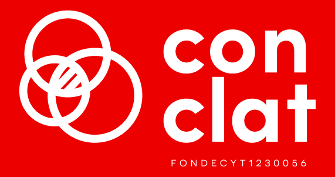

{width="100%"}

# Presentación {.unnumbered}

Este libro corresponde al repositorio de procesamiento y análisis de la base de datos de la **Encuesta CONCLAT** aplicada en Chile, para realizar la construcción de clases de Erik Olin Wright. Para capìtulo sobre clases en Chile. 

En el [primer capítulo](01-proce-data-conclat-cl.html) se preparan los datos de Chile generando las variables necesarias para armar los esquemas de clases, y en el [segundo capítulo](02-esquemas-clases-cl.html) se arman diferentes esquemas de clases con los datos de Chile.

En el [tercer capítulo](03-proc-marxism-clases-cl.html) se realiza la recodificación de algunas variables de interés para un capítulo de libro de Marxismo de Clases con los datos de Chile.

En el [cuarto capítulo](04-graph-clases-cl.html) se presentan algunos gráficos útiles de los esquemas de clases con los datos de Chile.

La Encuesta Conclat se aplica en el marco del Proyecto [CONCLAT](https://www.conclat.com/), que busca estudiar cómo se percibe el conflicto laboral y político en Argentina y Chile. Particularmente, analiza cómo las personas de distintas clases y con distinto estatus sindical perciben el conflicto dentro y fuera del lugar de trabajo. Tiene como propósito contribuir a la investigación internacional sobre clases, trabajo y conflicto produciendo datos cuantitativos originales y un instrumento de investigación comparable a nivel internacional.

[CONCLAT](https://www.conclat.com/) es el Proyecto FONDECYT Regular (No 1230056) “Clases sociales, movimientos sindicales y conflicto en tiempos de crisis: un estudio comparativo de Argentina y Chile”. Patrocinado por la [Universidad de Chile](https://uchile.cl/) y financiado por la Agencia Nacional de Investigación y Desarrollo ([ANID](https://anid.cl/)). 

---

::: {style="display: flex; justify-content: center; align-items: center; gap: 40px; margin-top: 2rem; flex-wrap: wrap;"}
[{height="80px"}](https://www.conclat.com/)

[{height="80px"}](https://uchile.cl/)

[{height="80px"}](https://anid.cl/)
:::
